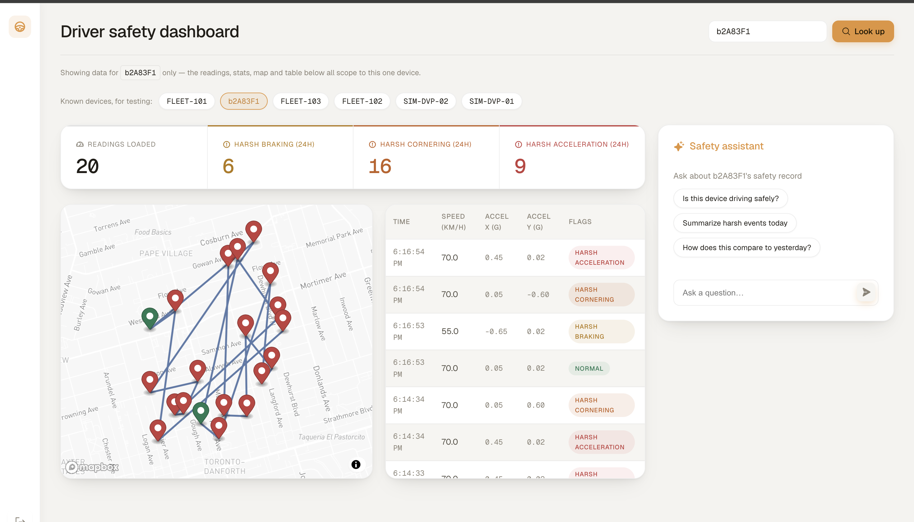

# Telematics Ingestion & Driver Safety Analytics Pipeline

A three-service telematics platform that ingests live vehicle data, detects harsh-driving events in real time, and lets you ask an AI assistant about a fleet's safety record in plain English.

It's a portfolio project built to demonstrate the kind of engineering a fleet-telematics company (e.g. Geotab) actually does: per-device event ingestion, real-time safety scoring against physically-grounded thresholds, and serving that data through fast, authenticated, well-tested APIs. It is not yet load-tested or built for high-throughput ingestion — see [Trade-offs / next steps](#trade-offs--next-steps).



## Contents

- [Why this project](#why-this-project)
- [Architecture](#architecture)
- [Features](#features)
- [Prerequisites](#prerequisites)
- [Setup](#setup)
- [Usage](#usage)
- [Configuration reference](#configuration-reference)
- [Development & testing](#development--testing)
- [Project structure](#project-structure)
- [Trade-offs / next steps](#trade-offs--next-steps)
- [Contributing](#contributing)
- [License](#license)

## Why this project

- **Safety thresholds aren't guessed.** Harsh braking (`-0.4g`), cornering (`±0.45g`), and acceleration (`0.35g`) all match the example thresholds in Geotab's own MyGeotab Rule Conditions documentation.
- **The demo data is physically real, not random.** The included trip simulator derives every G-force reading from actual speed deltas and yaw rate along a real route, not hardcoded noise — a dry run predicts exactly how many harsh events the API should detect, and it does.
- **Every layer is authenticated.** Dashboard operators log in with a password (JWT, rate-limited per source IP); devices authenticate with a per-device API key that can only post under its own device ID. Authentication is not yet the same thing as per-user data isolation — see [Trade-offs / next steps](#trade-offs--next-steps).
- **The Redis leaderboard is self-healing.** It's a derived view over Postgres, not a second source of truth: on every API startup it's rebuilt from a fresh Postgres aggregate, so a Redis restart or an outage mid-ingest can't leave it permanently wrong. It's exposed via the API; the dashboard itself shows per-device stats rather than a cross-fleet ranking.
- **123 automated tests**, including tests that run against real PostgreSQL and Redis instances rather than mocks, specifically to catch bugs a mock would hide.

## Architecture

```
React dashboard (5173) ──┬──► .NET 9 API (5231) ──► PostgreSQL   (history)
                          │        │                 Redis        (live safety leaderboard)
                          │        │
                          └──► FastAPI AI assistant (8000)
                                   │  forwards the caller's own JWT rather than a
                                   └─ service credential -- see Trade-offs for what
                                      that does and doesn't guarantee today
                                      (calls the .NET API's own endpoints as "tools")

C# trip simulator (standalone) ──► POSTs realistic telemetry at the .NET API
```

Everything above runs with one `docker compose up` — see [Docker Compose](#the-fast-way-docker-compose).

## Features

- **Ingestion API** — validates incoming telemetry, persists it, and runs three harsh-event detectors (braking, cornering, acceleration) on every reading
- **PostgreSQL** for durable history; **Redis** for a live driver-safety leaderboard (a sorted set, not a cache-as-afterthought) that degrades to "unavailable" instead of breaking ingestion if Redis is down, and rebuilds itself from Postgres on every API startup
- **Auth** — JWT login for humans (rate-limited against brute-forcing), scoped API keys for devices, both accepted on ingestion
- **AI safety assistant** — natural-language Q&A over real fleet data via Gemini function calling, with multi-turn conversation memory and its own rate limiter
- **React + TypeScript dashboard** — a live Mapbox trail color-coded by safety event, auto-polling stats, a picker showing every device that actually has data (no guessing IDs), and the assistant pinned alongside it
- **A realistic trip simulator** — generates a scripted drive with known, predictable harsh events instead of relying on manually clicking test buttons
- **One-command local stack** — `docker compose up` builds and runs all five services together, migrated and seeded automatically

## Prerequisites

- [Docker](https://www.docker.com/) — if you're using the Docker Compose setup below (the fast path)

or, to run everything natively:

- [.NET 9 SDK](https://dotnet.microsoft.com/download)
- [Node.js](https://nodejs.org/) 20+
- [Python](https://www.python.org/) 3.12+
- PostgreSQL and Redis (e.g. via Homebrew: `brew install postgresql@16 redis`)

Either way, you'll need:

- A free [Mapbox](https://www.mapbox.com/) token (for the dashboard map)
- A free [Gemini API key](https://ai.google.dev/) (for the AI assistant)

## Setup

### The fast way: Docker Compose

Needs only [Docker](https://www.docker.com/) — not the .NET/Node/Python toolchains below.

```bash
cp .env.example .env
```

Edit `.env` and fill in `JWT_SIGNING_KEY` (`openssl rand -base64 48`), `GEMINI_API_KEY`
([Google AI Studio](https://ai.google.dev/)), and `VITE_MAPBOX_TOKEN`
([Mapbox](https://www.mapbox.com/)) — the other values have working defaults.

```bash
docker compose up --build
```

This builds and starts all five services — Postgres, Redis, the .NET API, the AI assistant,
and the dashboard — wired together on one network, with the database migrated and a demo
login (`demo` / `DemoPass123!`) seeded automatically on first boot. Open
`http://localhost:5173`.

The trip simulator isn't part of the default stack (it's a one-off CLI tool, not a
long-running service) — run it on demand instead:

```bash
docker compose run --rm simulator --device b2A83F1 --api-key <key> --api http://api:5231/api/telematics
```

Everything below this is the manual, non-Docker setup — useful for actively developing one
service at a time with real hot-reload, but not required just to run the stack.

### 1. Start Postgres and Redis, and create the database

```bash
brew services start postgresql@16
brew services start redis
createdb telematics_pipeline
```

> The dev connection string in `TelematicsPipeline.Api/appsettings.Development.json` defaults to a local username of `Abdullah` — update `Username=` in the `TelematicsDb` connection string to match your own Postgres role before running the API.

### 2. Run the API

```bash
cd TelematicsPipeline.Api
dotnet user-secrets set Jwt:SigningKey "$(openssl rand -base64 48)"
dotnet run
```

On first run (Development only) this applies pending migrations and seeds a demo login automatically — **username `demo`, password `DemoPass123!`**. The API listens on `http://localhost:5231`.

### 3. Run the AI assistant

```bash
cd ai-assistant
python3 -m venv .venv
.venv/bin/pip install -r requirements.txt
cp .env.example .env
```

Edit `.env` and set:
- `GEMINI_API_KEY` — from [Google AI Studio](https://ai.google.dev/)
- `JWT_SIGNING_KEY` — must exactly match the value you set in step 2 (`dotnet user-secrets list` in `TelematicsPipeline.Api` to see it again)

```bash
.venv/bin/uvicorn app.main:app --port 8000
```

### 4. Run the dashboard

```bash
cd client
npm install
echo "VITE_MAPBOX_TOKEN=pk.your_token_here" > .env.local
npm run dev
```

Open `http://localhost:5173` and log in with the demo credentials from step 2.

### 5. (Optional) Generate a realistic trip

```bash
cd TelematicsPipeline.Simulator
dotnet run -- --dry-run          # preview without sending anything
dotnet run -- --device b2A83F1   # actually POST the trip to the running API
```

## Usage

**Ask the AI assistant a question** (from the dashboard, or directly):

```bash
TOKEN=$(curl -s -X POST http://localhost:5231/api/auth/login \
  -H "Content-Type: application/json" \
  -d '{"username":"demo","password":"DemoPass123!"}' | jq -r .token)

curl -s -X POST http://localhost:8000/ask \
  -H "Authorization: Bearer $TOKEN" \
  -H "Content-Type: application/json" \
  -d '{"question":"Is device b2A83F1 driving safely?","device_id":"b2A83F1"}'
```

**Provision a device API key** (so a real device, not just the dashboard, can POST telemetry):

```bash
scripts/provision-device.sh b2A83F1
```

**See what devices actually have data** (the dashboard's device picker uses this too):

```bash
curl -s http://localhost:5231/api/telematics/devices -H "Authorization: Bearer $TOKEN"
```

**Check the live safety leaderboard** (API-only — not currently surfaced in the dashboard):

```bash
curl -s http://localhost:5231/api/telematics/leaderboard -H "Authorization: Bearer $TOKEN"
```

## Configuration reference

Running natively, each service reads its own config file. Running via Docker Compose, all
of it comes from one root-level `.env` (see `.env.example`) instead.

| Variable | Where (native) | Purpose |
|---|---|---|
| `Jwt:SigningKey` | `.NET` user-secrets | Signs and validates dashboard login tokens |
| `ConnectionStrings:TelematicsDb` | `appsettings.Development.json` | PostgreSQL connection |
| `ConnectionStrings:Redis` | `appsettings.Development.json` | Redis connection (optional — API degrades gracefully without it) |
| `GEMINI_API_KEY` | `ai-assistant/.env` | Gemini function-calling API key |
| `JWT_SIGNING_KEY` / `JWT_ISSUER` / `JWT_AUDIENCE` | `ai-assistant/.env` | Must match the .NET API's JWT config exactly |
| `VITE_MAPBOX_TOKEN` | `client/.env.local` | Mapbox public token for the trip map |
| `POSTGRES_USER` / `POSTGRES_PASSWORD` / `POSTGRES_DB` | Docker Compose only (`.env`) | Credentials for the Postgres container |

## Development & testing

```bash
# All .NET tests (API + simulator) — 86 tests, includes real Postgres/Redis integration tests
dotnet test

# Frontend tests — 37 tests
cd client && npm test

# Type-check the frontend
cd client && npx tsc -b
```

The API's integration tests run against a separate `telematics_pipeline_test` database and Redis logical database 1, so they never touch your dev data:

```bash
createdb telematics_pipeline_test
```

## Project structure

```
TelematicsPipeline.Api/        .NET 9 Web API — ingestion, auth, safety detection
TelematicsPipeline.Simulator/  C# console app — generates realistic trip data
ai-assistant/                  FastAPI service — Gemini function-calling AI assistant
client/                        React + TypeScript dashboard
tests/                         xUnit test projects for the API and simulator
scripts/                       Operational scripts (e.g. device provisioning)
docker-compose.yml             Orchestrates all five services for `docker compose up`
```

## Trade-offs / next steps

Honest gaps, not yet fixed:

- **No per-user data isolation.** Every read endpoint (`GET /{deviceId}/recent`, the harsh-event counts, the leaderboard) is `[Authorize]`-only — any valid dashboard JWT can query *any* `deviceId`, not just ones that JWT's user owns. The AI assistant inherits this: it forwards the caller's JWT to the .NET API (so it can't see more than that JWT already can), but `conversation_id` is a client-supplied UUID with no ownership check, so a guessed or leaked ID can be read or cleared by any authenticated user. This works today because there's exactly one demo user and no concept of a "fleet" yet. Fixing it for real means adding an owning user/fleet to `DeviceApiKeys`, filtering every device-scoped query by that ownership, and keying conversations by user rather than by client-supplied ID alone.
- **Not built for high-throughput ingestion.** `POST /ingest` is one HTTP request and one Postgres commit per reading, with no idempotency key (a retried request double-counts), no batching or queue in front of the database, no composite `(DeviceId, Timestamp)` index, and no load test behind the current design. Fine for a demo device or two; a real fleet posting at 1 Hz each would need all four.

## Contributing

This is a personal portfolio project and isn't set up to accept external contributions.

## License

Personal portfolio project — no license is granted for reuse or redistribution.
